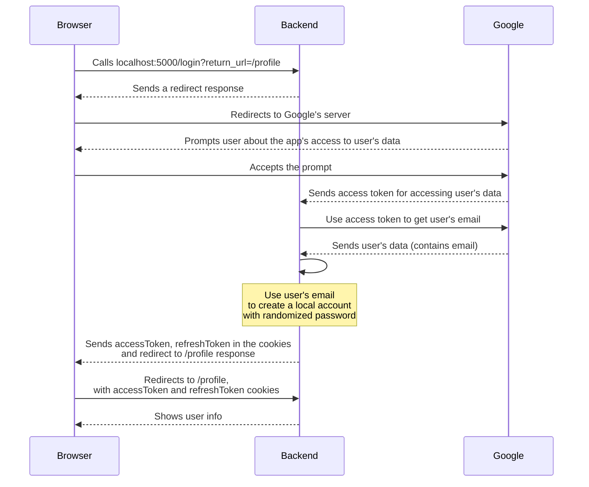

# Simple Axum Google OAuth2 Example
This is a very simple example of how you can integrate Google OAuth2 into your `axum` backend <br>
This example only contains the backend, as in this case no frontend is needed <br>

<br>

# The code structure:
```bash
simple-axum-google-oauth
├── prisma
│   └── schema.prisma       # Database schema
├── prisma-cli
│   ├── src
│   │   └── main.rs         # Prima's CLI
│   └── Cargo.toml
├── src
│   ├── routes              # Endpoints
│   │   ├── callback.rs     # Callback route
│   │   ├── login.rs        # Login route
│   │   ├── mod.rs        
│   │   └── profile.rs      # Profile route
│   ├── utils               # Ultilities folder   
│   │   ├── cookie.rs       # Create cookies
│   │   ├── decode.rs       # Decode tokens
│   │   ├── encode.rs       # Encode tokens
│   │   ├── google.rs       # Create google client
│   │   ├── mod.rs
│   │   └── rand_pw.rs      # Random password generator
│   ├── config.rs           # Env fields
│   ├── error.rs            # Error classes
│   ├── main.rs             # Application starting point
│   ├── model.rs            # Models
│   └── response.rs         # Web response format
├── Cargo.lock
├── Cargo.toml              # Dependency list
├── Dockerfile              # Rust container
├── docker-compose.dev.yml  # Starts Postgres
├── docker-compose.prod.yml # Builds application stack
└── readme.md
```

# Authentication flow


# How to deploy
Customize your values, in the [`docker-compose`](./docker-compose.yml) file. And then:
```zsh
docker-compose -f docker-compose.prod.yml up -d
```